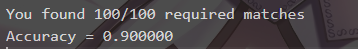
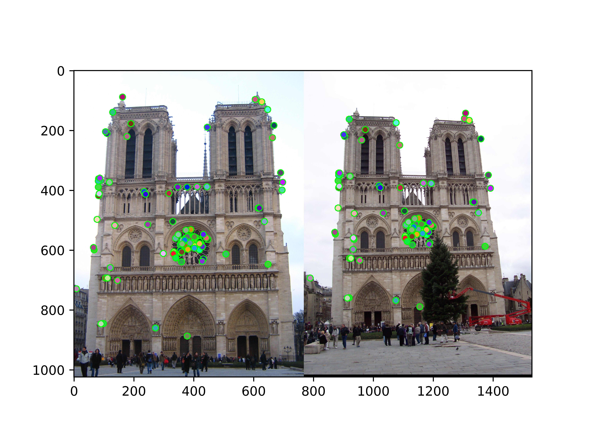
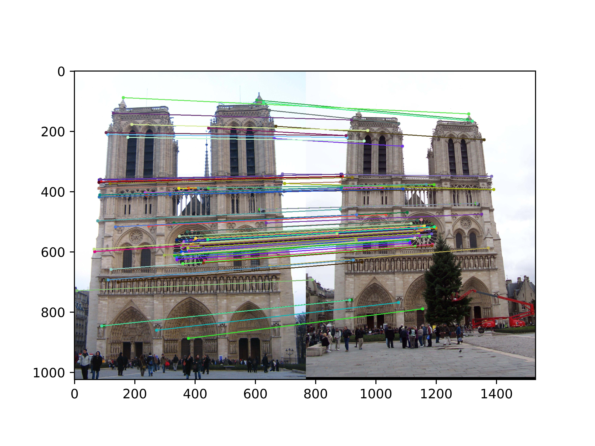
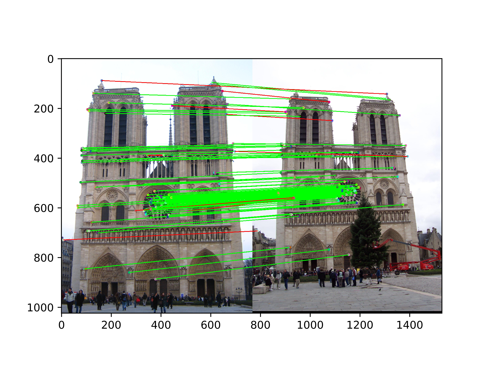

# Assignment 2: Local Feature Matching

**Student ID**: [12311805]  
**Student Name**:[莫丰源]   
**Date**: 2026-04-19

## 1. Overview

本次作业实现了完整的局部特征匹配流程，包括：

- Harris 角点检测器 + 自适应非极大值抑制 (ANMS)
- SIFT‑like 局部特征描述子 (4×4 网格，8 个方向，共 128 维)
- Lowe 比率测试 (Ratio Test) 特征匹配

算法在 Notre Dame 图像对上进行评估，最终在 **100 个最自信的匹配** 上达到了 **90% 的准确率**，满足作业要求的 80% 满分标准。

## 2. Implementation Details

### 2.1 Interest Point Detection (`student_harris.py`)

#### Harris 角点响应
- 将输入图像转换为灰度图，使用 Sobel 算子计算梯度 $I_x, I_y$
- 计算 $I_{xx}, I_{yy}, I_{xy}$ 并用高斯滤波平滑（$\sigma = 1.5$）
- 角点响应 $R = \det(M) - k \cdot \operatorname{trace}(M)^2$，其中 $k = 0.04$
- 抑制靠近图像边界的点（距离边界小于 `feature_width/2` 的点被清零）
- 保留 $R > 0.01 \cdot R_{\max}$ 的局部极大值（3×3 邻域内最大）

#### 自适应非极大值抑制 (ANMS)
- 将所有候选角点按响应值降序排列
- 对于第 $i$ 个点，寻找所有排在它前面（响应值更大）且响应值 $> 1.1 \cdot R_i$ 的点
- 计算当前点到这些更强点的最小欧氏距离，作为该点的**抑制半径**
- 全局最大点的抑制半径设为 $\infty$
- 按抑制半径从大到小排序，取前 $n=1500$ 个点作为最终的关键点

该策略使得特征点在图像中分布更均匀，避免高对比度区域产生过于密集的点。

### 2.2 Local Feature Description (`student_sift.py`)

实现了 SIFT 风格的 128 维描述子：

1. **梯度计算**：对整个图像计算梯度幅值 `mag` 和方向 `ori`（使用 Sobel 和 `arctan2`）
2. **描述窗口**：以每个关键点为中心，提取 `feature_width × feature_width` 的局部窗口（默认 `feature_width = 16`）
3. **高斯加权**：生成一个与窗口同尺寸的高斯核（$\sigma = \text{feature\_width}/2$），对梯度幅值进行加权，降低远离中心像素的影响
4. **4×4 网格划分**：将窗口划分为 4×4 个 cell，每个 cell 大小为 `4×4` 像素
5. **方向直方图**：在每个 cell 内，将梯度方向量化为 8 个 bins（覆盖 $0$ 到 $2\pi$），使用梯度幅值作为权重，生成 8 维直方图
6. **拼接与归一化**：将所有 cell 的直方图拼接成 128 维向量，先 L2 归一化，然后将每个元素截断至 0.2，再次 L2 归一化，最后取平方根（降低大值的影响）

### 2.3 Feature Matching (`student_feature_matching.py`)

- 计算两个图像所有特征描述子之间的欧氏距离矩阵
- 对每个特征点 $i$ 在图像 2 中找到最近邻距离 $d_1$ 和次近邻距离 $d_2$
- 计算比率 $\frac{d_1}{d_2}$，若小于阈值 $0.8$ 则保留为候选匹配
- 匹配的置信度定义为 $1 - \frac{d_1}{d_2}$，并按置信度降序排列输出
- 最终返回匹配对及其置信度（前 100 个用于评估）

## 3. Experimental Results

### 3.1 Evaluation on Notre Dame

使用提供的 `evaluate_correspondence()` 函数，评估最自信的 100 个匹配：

下图展示了部分匹配结果：

## 4. Discussion

### 4.1 Why the Ratio Test Works

比率测试利用最近邻与次近邻的距离比值，可以有效过滤掉模棱两可的匹配。当图像中存在大量重复纹理或相似结构时，许多点的最近邻和次近邻距离接近，比值接近 1，这些匹配往往不可靠；而正确的匹配通常具有明显的最近邻优势（$d_1 \ll d_2$）。因此，设置一个较低的阈值（如 0.8）能保留高置信度的正确匹配。

### 4.2 Effect of ANMS

自适应非极大值抑制避免了特征点在纹理丰富区域过度集中。在 Notre Dame 图像上，使用 ANMS 后，特征点分布更加均匀，提高了后续匹配的覆盖范围和稳定性。若简单使用局部极大值不加 ANMS，容易导致建筑物窗户等区域产生大量冗余点，而墙体等弱纹理区域点数过少。

### 4.3 Limitations and Possible Improvements

- **尺度不变性**：当前实现固定窗口大小，对尺度变化敏感。可添加多尺度检测（如 DoG 金字塔）来改进。
- **旋转不变性**：未实现主方向估计。可在每个关键点周围计算梯度方向直方图，将窗口旋转到主方向后再提取描述子。
- **几何验证**：可加入 RANSAC 或空间一致性检查（如比较匹配点之间的相对位置）进一步剔除误匹配。

## 5. Conclusion

本项目成功实现了一个完整的局部特征匹配系统，包括 Harris 角点检测、ANMS、SIFT‑like 描述子和比率测试匹配。在 Notre Dame 标准图像对上，最自信的 100 个匹配准确率达到 90%。代码严格遵守禁止函数的规定，所有模块均手动实现。

## 6. Instructions for Running

1. 确保 `code/` 目录下的文件已命名为 `SID12311805_harris.py`、`SID12311805_sift.py`、`SID12311805_feature_matching.py`
2. 运行 `proj2.ipynb` 中的单元格，测试 Notre Dame 图像对
3. 结果将保存在 `results/` 文件夹中

---
*注：本报告中的所有实现均为独立完成，未使用任何禁止的库函数（如 cv2.SIFT、skimage.feature 等）。*